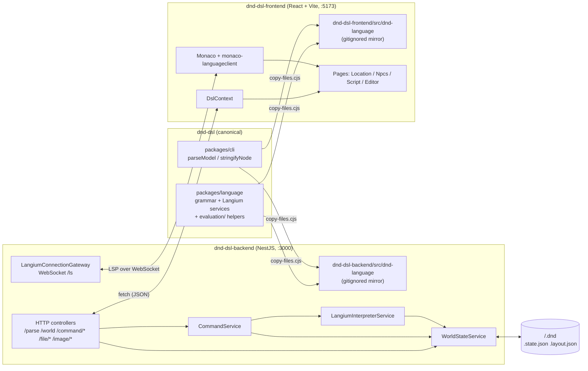
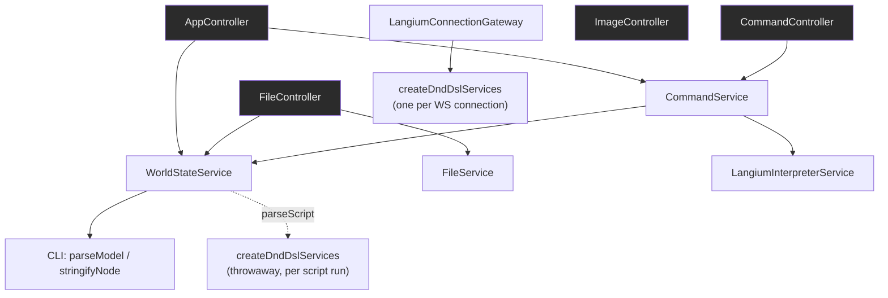
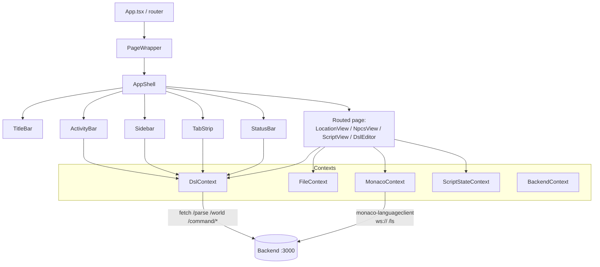
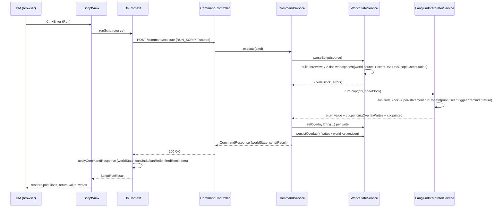

# DnD DSL - Architecture Reference

A class-by-class map of the three projects: what each major piece is responsible for,
and how they fit together. Companion to [CLAUDE.md](CLAUDE.md), which covers repo
layout, commands, and conventions - this file goes one level deeper, into the actual
classes and components.

Depth convention used throughout: **major** components (a distinct architectural
responsibility) get a full description; everything else is listed in a compact
appendix table at the end of its section, name + one line.

## System overview

Three independent npm projects, no shared `node_modules`. `dnd-dsl/packages/language`
is the single source of truth for the DSL; `copy-files.cjs` byte-copies it (plus the
CLI and the TextMate grammar) into gitignored mirrors inside both the backend and the
frontend, so all three projects compile against their own local copy with no
cross-project build step.

---

# 1. The language (`dnd-dsl/`)

## 1.1 What a `.dnd` file can express

The grammar (`packages/language/src/dnd-dsl.langium`) defines the DSL. A file is one
`World`, either a full world description or a script that references one:

| Construct | Purpose |
| --- | --- |
| `world "Name" ...` | The root declaration - holds locations, npcs, quests, events, functions, enums, and top-level `let` variables (any mix, in any order). |
| `reference world "Name" <statements>` | A **script file** - the second `World` alternative. Parses as a `World` node too (so `Model.World` stays required), but runs its `CodeBlock` against an already-loaded world instead of declaring one. This is what powers the `/script` console. |
| `location "Name" ... end` | Entry/exit points, its own `let` variables, a description, and nested `sublocations` (arbitrary depth). Location names are enforced globally unique across the whole nesting tree. |
| `quest "Name" ... objective "..." ...` | A quest with one or more objectives, each with its own variables and `enabled on` / `requierement` / `on completed` / `on failed` hooks (parsed today; not yet evaluated by the interpreter - quest lifecycle is still "an enum the DM changes by hand," not a driven state machine). |
| `event "Name" do ... end` | A named, triggerable code block. |
| `npc "Name" ...` | A named entity with a description and `let` variables (added in the enums/manual-state phase; not yet shown on the map). |
| `function name(params) do ... end` | A callable unit with parameters and a body; can be invoked from the UI's function panel, a script, or another function/event. |
| `enum Name { A, B, C }` | A closed set of named values. Referenced as `Name::Value` (`EnumValueRef`) - a real cross-reference (autocomplete + a linking error on a typo), not a bare string. |
| `let x = <expr>` / `let x: Enum = Enum::Value` / `let computed x = <expr>` | A variable: a stored value, an enum-typed value, or a recomputed-on-read expression. Any of `Location` / `Npc` / `Quest` / `Objective` / `World` / an `object` block can own `let`s. |
| `object let a = 1 ... end` | A nested record literal - lets a variable hold a small group of sub-variables (`Resources . Gold`, for example). |

**Statements** (inside any `CodeBlock` - a function/event body, a `when`/`otherwise`
branch, or a script body):

| Statement | Effect |
| --- | --- |
| `call fn with a, b` / `call predefined name with ...` | Invoke a declared or built-in function. |
| `set <RefChain> = <expr>` | Persistent write to an entity-owned variable (`set npc "X" . mood = ...`) - the only way a script can mutate world state that survives past the run. |
| `x = <expr>` (`VariableAssignment`) | Assigns a local/function-scoped variable, **or** a persistent one if the target resolves to an entity-owned `let` (`nodeToStatePath` succeeds). |
| `when <bool> do ... (otherwise do ...)? end` | Conditional branching. `otherwise` was added 2026-09-10. |
| `trigger "Event"` | Runs another event's body inline, in the same context (one undo entry covers the whole cascade). Guarded against re-entrant self-triggering. |
| `let x = <expr>` | Local variable declaration, scoped to the rest of the enclosing `CodeBlock`. |
| `return <expr>?` | Exits the current function/script early with a value. |
| `remind "label" (after <Duration>)? (severity ...)? (show on <RefChain>)? (do ... end)?` | Schedules a reminder, or - with no `after` - fires it immediately in the same command. |
| `print <expr>` | Collects a value into the command's `printedValue` list, shown in the `/script` console above the return value. Debugging/output aid, no state effect. |

**Expressions:** arithmetic (`+ - * /`), comparison (`== != < > <= >=`, plus `is`/`is not`
for enum/identity equality), logical (`and`/`or`, short-circuiting), grouping, and
`RefChain` - a `.`-separated path starting at `location "X"` / `npc "X"` / `quest "X"` /
`event "X"` / a bare variable, then zero or more `.member` steps into nested
variables. Every `.` step is a real Langium cross-reference (not a string key), so it
gets autocomplete and a linking error on an unresolved name.

**What's declared but not yet driven:** `enabled on` / `requierement` / `on completed`
/ `on failed` on quests/objectives parse but are never evaluated; there is no `for`/list
type yet (next roadmap item); dialogs/choices don't exist yet. See the
`dsl-expressive-power-roadmap` memory for the sequenced plan.

## 1.2 Tooling classes (Langium custom services)

All four are wired together in **`dnd-dsl-module.ts`** (`createDndDslServices` /
`DndDslModule`) - the dependency-injection module every consumer (the CLI, the backend's
LSP gateway, the backend's own `parseModel`/`WorldStateService.parseScript`, and every
canonical test) builds its Langium services from. This is the one place that assembles
the whole language: default Langium services + generated grammar module + these four
overrides.

- **`DndScopeProvider`** (`scope-provider.ts`) - overrides `getScope` for two cases
  Langium's default can't handle: (1) a `.`-chain member reference (`getMemberScope`) -
  narrows to the *previous segment's* own `.variables` (a Location/Npc/Quest, or an
  `object`-valued `let`), with no global fallback, so an unknown member is a hard
  linking error rather than accidentally binding to a same-named variable elsewhere;
  (2) an `EnumName::Value` reference - scoped to that one enum's values, resolved by
  name either against the enclosing `World` or (for a script's own reference-only
  `World`) the workspace's global `Enum` index.
- **`DndScopeComputation`** (`scope-computation.ts`) - exports a **whole** world's named
  tree to the global index, not just `Model`'s direct child (Langium's default). This is
  what lets a separately-parsed script document (`reference world "X" ...`) link its
  `location "Y"` / `npc "Z"` / `call fn` / `trigger "E"` against an already-parsed world
  document in the same workspace. `VariableDeclaration` is deliberately excluded, so a
  variable is only ever reachable through a `.`-member step, never as a bare global name.
- **`DndCompletionProvider`** (`completion-provider.ts`) - two completion gaps the
  built-in cross-reference completion misses in this grammar, plus trigger characters:
  (1) **member completion** - synthesizes the `VariableRef`-shaped node
  `DndScopeProvider.getMemberScope` expects, from the CST leaf before the cursor, so
  `location "X" . <Tab>` offers real members even while the segment is still empty or
  half-typed; (2) **entity-name completion** - a regex scan of the current line
  (bypassing the parser's error-recovery state) offers `IndexManager.allElements(type)`
  for `location`/`npc`/`quest`/`trigger`/`event`, fixing multi-word names past the
  space and the `quest "` bare-quote keyword collision; declares `"` and `.` as LSP
  trigger characters so both lists open without a manual Ctrl+Space.
- **`DndDslValidator`** (`dnd-dsl-validator.ts`) - uniqueness checks (locations across
  the whole nested tree, objectives per quest, enum values per enum, and
  npcs/quests/events/functions/enums at the world level); enum-typed `let` / enum
  comparison type-checking (`EnumA::x` used where `EnumB` is expected, or compared to
  it); and `remind` placement (only legal inside a function, event, or script body -
  walks up to the first `Function`/`Event`/`World` ancestor, rejecting one reached via a
  `Quest`/`Objective` handler first).

## 1.3 Evaluation & shared helpers (`evaluation/`)

These files are plain TypeScript with no Langium LSP-only imports, so they're safe to
import from the browser frontend as well as the Node backend - this is what keeps the
"three evaluators" (below) as thin as they are.

- **`dnd-dsl-expression-ops.ts`** - the one place arithmetic/comparison/logical operator
  rules and `IntVal`/`BoolVal` unwrapping live (`applyArithmetic`, `applyComparison`,
  `applyLogical`, `signedInt`, `negatableBool`). All three expression evaluators
  delegate to it instead of reimplementing operator semantics.
- **`dnd-dsl-value-evaluator.ts`** - `evaluateSerializedExpression`, the **canonical**
  pure evaluator over the JSON-serialized model (as opposed to the live AST). Also
  `resolveSerializedRefChain` (resolves a chain to its target node without evaluating
  it) and `buildVariablesRecord` (turns an entity's `.variables` into a plain
  `{name: value}` record) - both reused directly by the frontend's own evaluator rather
  than being reimplemented there.
- **`dnd-dsl-state-path.ts`** - `StatePath`, a name-based address to a declared entity
  or variable (`{kind:'npc', name}` + `{kind:'variable', target}`, etc.), chosen over
  Langium's positional `AstNodeLocator` paths specifically so a path stays valid across
  `.dnd` edits that reorder or insert siblings. `nodeToStatePath` / `statePathToNode`
  convert between an AST/JSON node and a path; `resolveVariableContainer` is what lets
  `ASSIGN_VARIABLE` create a variable that wasn't declared in the source. This is the
  addressing scheme the runtime state overlay is keyed on.
- **`dnd-dsl-commands.ts`** - the `Command`/`CommandResponse` contract shared verbatim
  by the frontend and backend (`ADVANCE_TIME`, `ACK_REMINDER`, `ASSIGN_VARIABLE`,
  `ASSIGN_RUNTIME_VARIABLE`, `CALL_FUNCTION`, `TRIGGER_EVENT`, `RUN_SCRIPT`) - the single
  source of truth for what a "command" looks like on the wire.
- **`dnd-dsl-reminders.ts`** - `ScheduledReminder`/`FiredReminder` types, and the
  locate-by-name-and-position pair `computeRemindBodyLocator` / `resolveRemindBodyLocator`
  that lets a scheduled reminder's effect body survive a process restart or a fresh
  parse (a live CodeBlock reference couldn't).
- **`dnd-dsl-clock.ts`** - round/minute/hour/day duration math (`durationToRounds`,
  `formatClock`); 10 rounds/minute, the rest derived.
- **`dnd-dsl-reference.ts`** - `parseReferenceFromModel` / `parseReferenceFromSerializedModel`,
  resolving a serialized `{ $ref: "#/World/..." }` string back to the node it points at,
  by walking the path segments (handles the `name@index` array-element form).
- **`dnd-dsl-serialized-types.ts`** - the `SerializedNode<T>` mapped type (a Langium AST
  interface with every `Reference` turned into `{$ref}` and internal `$container`-style
  fields stripped) plus one named alias per entity type (`SerializedLocation`,
  `SerializedNpc`, ...) - what the frontend's TypeScript types are actually built from.

## 1.4 CLI package (`packages/cli/`)

Not a standalone tool in practice today - its real job is supplying `parseModel` and
`stringifyNode` to the backend (`WorldStateService.loadFromFile` calls `parseModel`
directly; `rebuildWorldState` calls `stringifyNode`). `main.ts` also exports
`DndDslParseError` (thrown with the failing diagnostics attached) and a `generate`
command (`generateAction` - unrelated demo codegen, not part of the app's real flow).
`util.ts` / `parser/*.ts` are minor helpers, see the appendix.

## 1.5 Everything else in the language package

| Item | One-line role |
| --- | --- |
| `generated/*` | Langium-generated AST types, grammar, and DI module - never hand-edited, regenerated by `langium generate`. |
| `packages/cli/src/util.ts` | `extractDocument` - loads a `.dnd` file into a Langium document. |
| `packages/cli/src/generator.ts` | Demo "Hello, {name}!" JS codegen from a parsed model - unrelated to the DSL runtime. |
| `packages/cli/src/parser/*.ts` | Legacy pre-Langium hand-rolled parsers, superseded by the grammar; not on the live code path. |
| `packages/extension/` | The VS Code extension shell (`extension/main.ts`, `language/main.ts`) - registers the language and its TextMate grammar for a standalone VS Code install; not what the app's own `/editor`/`/script` pages use (they talk to the backend's LSP gateway instead). |

---

# 2. Backend (`dnd-dsl-backend/`)

NestJS 11, ESM, HTTP API on port 3000 plus a WebSocket LSP gateway. Every controller
and service below is a Nest singleton for the process's lifetime - two browser tabs
against one backend already share the exact same `WorldStateService`/`CommandService`
instance (see the `multi-page-live-sync-roadmap` memory for what that does and doesn't
already give you).

## 2.1 Bootstrapping & configuration

- **`AppModule`** - wires every controller/service below into one Nest module (no
  feature modules - a flat provider list).
- **`ConfigurationService`** - reads `config/config.json` (tracked, machine-specific)
  once at startup: `DefaultFilePath` (an absolute folder *outside* the repo holding
  `<adventure>/<world>.dnd` and its sidecars), `WorldName`, `AdventureName`.
- **`FileService`** - three pure path builders off `ConfigurationService.DefaultFilePath`:
  the `.dnd` file, the `.layout.json` (ReactFlow node positions), and the `.state.json`
  (runtime overlay) paths for a given adventure/world.

## 2.2 Controllers (HTTP surface)

- **`AppController`** - `POST /parse` (re-parses the `.dnd` file into `WorldStateService`,
  the entry point every world load/switch and every `/editor` save-triggered reload goes
  through), `GET /world` (the served, overlay-applied state), `GET /world/functions` /
  `GET /world/events` (for UI pickers), `POST /world/functions/:name` / `POST
  /world/events/:name` (thin wrappers around `CommandService.execute`), `GET
  /world/agenda` (clock + upcoming + fired reminders). Also a legacy `POST /execute`
  (dynamic-imports a generated JS file - unrelated demo code, not part of the real app).
- **`FileController`** - `.dnd` file load/save (raw text, no parse), map layout
  load/save (per-location node positions), and state-overlay load/reset.
- **`CommandController`** - `POST /command/execute` / `/undo` / `/redo`, all three
  routed through `runOrThrow400` so a `CommandService` `Error` becomes a readable 400
  instead of an opaque 500.
- **`ImageController`** - streams a location's map image, resolved through the
  adventure's `Maps.json` name-to-file mapping.

## 2.3 Core services

- **`WorldStateService`** - **the world-state source of truth.** Holds the parsed
  live AST (`_model`), the last-loaded `.dnd` source text (`_worldSource`, needed by
  `parseScript`), the runtime overlay (`_overlay`), clock, and reminder queues. Its
  `rebuildWorldState` re-serializes the AST to JSON and re-applies every overlay entry
  on top (`applyOverlay`/`spliceOverlayValue`) - this runs on every load, undo, redo,
  and reset, which is what makes the overlay survive a fresh parse. `setOverlayEntry`
  is the *only* way a served variable's value changes after load, and it can also
  create a variable that was never declared in the source (as long as its parent
  container - a real entity or an `object` block - already exists). `parseScript`
  builds a **throwaway** two-document Langium workspace (the loaded world's source +
  the DM's script text) so a script's entity references link against the already-loaded
  world via `DndScopeComputation`, then tears the workspace down again.
- **`CommandService`** - **command execution + undo/redo.** One user action is one
  `HistoryEntry`; cascading effects (a chained `trigger`, a reminder tick's effect body)
  fold into that single entry rather than getting their own (see the
  `undo-redo-granularity` memory). `RuntimeStateSnapshot` (overlay + runtime vars +
  clock + reminders + fired-reminders, all `structuredClone`d) is what undo/redo
  restore; non-deterministic commands (anything running interpreter code, since a
  predefined function can be random) also capture a `post` snapshot so redo *restores*
  rather than re-executes. Each command type
  (`executeCallFunction`/`executeTriggerEvent`/`executeAdvanceTime`/`executeRunScript`)
  builds an `EvalContext`, hands it to the interpreter, then flushes
  `pendingOverlayWrites` through `WorldStateService.setOverlayEntry` before persisting.
- **`LangiumInterpreterService`** - **statement and expression execution over the live
  AST**, the only one of the three evaluators with side effects (it runs functions,
  fires events, schedules/fires reminders, collects pending writes). `EvalContext` is
  threaded explicitly through every call rather than injected, specifically to avoid a
  DI cycle with `WorldStateService`. `evaluateExpression`/`evaluateRefChain` read
  values (persistent reads go through the *served JSON* state, never the live AST's
  frozen `VariableDeclaration.value`, since overlay writes never touch the AST);
  `runCode`/`runCodeBlock` execute one `Code` statement or a whole block, short-
  circuiting on a `ReturnSignal`; `callFunctionDecl` builds a child scope via
  `Object.create(callerScope)` so nested calls see the caller's variables without
  mutating them.
- **`LangiumConnectionGateway`** - the **`/ls` WebSocket gateway** that turns a raw
  `ws` connection into an LSP `Connection` (via `vscode-ws-jsonrpc`) and starts a full
  Langium language server on it. Builds its **own** `createDndDslServices` per
  connection, so every custom service above (scope provider, completion, validator) is
  live for `/editor` and `/script`'s Monaco instances. Decodes `workspaceFolders` URIs
  on `initialize` (a Windows-path-with-spaces workaround).
- **`predefinedFunctions`** (`predefined/predefined-functions.ts`) - the DSL's built-in
  function library, today just `randomfv(min, max)`. `predefinedFunctionsAsMap` is what
  the interpreter's `call predefined ...` and unresolved-name fallback look up.

## 2.4 Legacy / unused

| Item | Status |
| --- | --- |
| `LangiumParserService` | Registered but only reachable via the legacy `POST /execute` demo path; the real flow (`WorldStateService.loadFromFile`) calls the CLI's `parseModel` directly instead. |
| `LangiumExportService` | A stub - `exportToText` always returns `""`. |
| `ImageService` | Registered as a provider but never injected anywhere; `ImageController` does its file I/O directly. |
| `AppController.executeLanguage` (`POST /execute`) | Dynamic-imports a generated JS file from an old codegen experiment; unrelated to the DSL's own interpreter. |

---

# 3. Frontend (`dnd-dsl-frontend/`)

React 19 + Vite, port 5173. Client-side routing with `react-router`; every route is one
full-screen page (see the `multi-page-live-sync-roadmap` memory for why "one tab, one
page" is being kept rather than building an in-app window manager). React Compiler is
enabled, so components are written as plain functions with no manual memoization.

## 3.1 App shell & routing

- **`App.tsx`** - the `BrowserRouter` route table (`/`, `/location/:locationName`,
  `/npcs`, `/script`, `/editor`), each wrapped in `PageWrapper`; mounts `ContextWrapper`
  once around the whole router, plus the always-present `ReminderToast`.
- **`PageWrapper`** - a one-line adapter handing the route's page name into `AppShell`.
- **`AppShell`** - the fixed CSS-grid layout (TitleBar / ActivityBar+Sidebar+main /
  StatusBar) every page renders inside. `TabStrip` and the routed page share the "main"
  grid area.
- **`TitleBar`** - static app name + menu labels (non-functional placeholders) plus the
  current adventure/world/location breadcrumb.
- **`ActivityBar`** - the icon rail (Home/Locations/NPCs/Script/Editor); each button
  just `navigate()`s - there's no open/close/multiplicity, it's a fixed nav list, not
  real tabs (see the window-handling discussion in `multi-page-live-sync-roadmap`).
- **`Sidebar`** - the location tree (always this, regardless of the active page),
  recursively expandable, showing each location's exits inline once selected.
- **`TabStrip`** - a second, denser nav row mirroring `ActivityBar`'s five destinations;
  same "just navigates" behavior, not independently closable/reorderable tabs.
- **`StatusBar`** - undo/redo buttons (bound to `DslContext`), the game clock with
  +round/+hour/+day buttons (`ADVANCE_TIME`), and an agenda popover (upcoming + fired
  reminders, acknowledge button) fetched from `GET /world/agenda`.

## 3.2 State contexts

- **`DslContext`** - **the state hub.** Owns `world`/`adventure` selection,
  `worldState` (the served JSON model), undo/redo availability, and the fired-reminders
  list; exposes `execute`/`undo`/`redo`/`runScript`/`reloadWorld`/`getByReference`.
  `reloadWorld` (re-parse + refetch) runs on mount/world-switch and after an `/editor`
  save, so an edit becomes live without a manual page reload. Global `Ctrl+Z`/`Ctrl+Y`
  handlers live here, in the bubble phase so Monaco's own undo (capture phase) gets
  first refusal.
- **`FileContext`** - raw `.dnd` file load/save (`GET`/`POST /file/*`) - what `/editor`
  and the script console's world-source fetch both go through.
- **`MonacoContext`** - the `/editor` page's Monaco `EditorApp` lifecycle
  (start/dispose/save). One editor instance at a time - `startEditor` disposes any
  existing instance before creating a new one.
- **`ScriptStateContext`** - a **ref-backed** (not `useState`-backed) store holding
  `/script`'s editor text, run history, and last result, keyed by world. Exists purely
  because a route change unmounts `ScriptView` and its Monaco instance; reading happens
  once on the next mount, writing never triggers a re-render.
- **`BackendContext`** - thin/legacy: just publishes the `BackendURL` constant through
  context, though most code imports the exported constant directly instead of consuming
  the context.

## 3.3 Pages

- **`LocationView`** (+ `MapFlow`) - the most complex view. Left pane: the location's
  `let` variables (with on-demand "Calculate" for `computed` ones, since a computed
  expression could in principle be expensive or side-effecting) and an enum dropdown
  where applicable; an "NPCs" sub-tab here is currently a stub (NPCs live in their own
  page, `/npcs`, not per-location yet). Right pane: `MapFlow`, a `ReactFlow` canvas with
  two modes - **Map** (draggable, positions persisted as normalized 0-1 fractions of the
  background-image's letterboxed rect via `map-coords.ts`, Ctrl+S to save) and **Tree**
  (read-only hierarchy from `tree-layout.ts`, stripping the map's parent-relative
  positioning). `nodeTypes`/`edgeTypes`/`nodeExtent` are hoisted to module constants -
  recreating them per render was the root cause of an earlier "nodes snap back on drag"
  bug, since `ReactFlow` remounts/re-clamps nodes whenever those object identities
  change.
- **`NpcsView`** - a flat list of every declared `npc`, each with its variables and enum
  dropdowns - the simpler sibling of `LocationView`'s left pane, with no map/tree side.
- **`ScriptView`** (+ `useScriptEditor`) - the DM console: a Monaco editor pre-seeded
  with the `reference world "<name>"` header, a Run button (`DslContext.runScript`),
  and an output panel rendering `print` lines, the return value, and the list of
  persistent writes, above an in-session run history. State survives navigation via
  `ScriptStateContext`.
- **`DslEditor`** - the `/editor` page: a thin wrapper mounting `MonacoContext`'s editor
  into a `
` and binding Ctrl+S to `MonacoContext.saveFile` (which now also calls
  `DslContext.reloadWorld()` so the edit goes live immediately).

## 3.4 Monaco / LSP integration

- **`MonacoInit.ts`** - a process-wide (well, tab-wide: `globalThis`-cached, so it
  survives Vite HMR module replacement) singleton building exactly one
  `MonacoVscodeApiWrapper` (configuration/keybindings/TextMate/theme service overrides)
  and one `LanguageClientWrapper` (the actual LSP client, over `ws://localhost:3000/ls`).
  Both `/editor` (`MonacoContext`) and `/script` (`useScriptEditor`) call
  `getMonacoInit()` and share this one instance - which is also why two Monaco-backed
  windows open **in the same browser tab at once** is an open problem (see
  `multi-page-live-sync-roadmap`); two separate browser tabs each get their own
  singleton for free.
- **`useScriptEditor`** - `/script`'s editor lifecycle hook: starts an `EditorApp` for
  the script text, and separately opens the loaded world's `.dnd` source as an
  **editor-less** model (`createModelReference`, no visible editor) purely so the
  language server's `DndScopeComputation` can link the script's entity references
  against it. Also owns `wireSuggestRecovery` - a fix for a Monaco `SuggestModel` bug
  where a completion request returning zero items parks the widget in a state where
  further typing can't re-trigger it.

## 3.5 Shared evaluation & small helpers

- **`expression-evaluator.ts`** - the frontend's own pure expression evaluator (parallel
  to the canonical `dnd-dsl-value-evaluator.ts`, and reuses its `resolveSerializedRefChain`
  directly rather than re-resolving RefChains itself). Returns a UI-shaped `EvalResult`
  (primitives, or a `SerialisedObjectDeclaration` splitting static vs. `computed`
  sub-properties so the view can lazily "Calculate" the expensive ones).
- **`location-tree.ts`** - `findLocation` / `findPathToLocation`, recursive lookups over
  the nested `sublocations` tree (the latter drives the Sidebar's auto-expand-to-current
  behavior).
- **`EnumValueSelect`** - a reusable `<select>` for an enum-typed `let`; present only
  when the variable carries an `enumType`, issues `ASSIGN_VARIABLE` on change.
- **`ReminderToast`** - renders `DslContext.firedReminders` as dismiss-able toasts,
  acknowledging via `ACK_REMINDER`.

## 3.6 Everything else in the frontend

| Item | One-line role |
| --- | --- |
| `map-coords.ts` | Pure letterbox/normalize math for `MapFlow` - no React dependency. |
| `tree-layout.ts` | Lays `MapFlow`'s graph out as a root/sublocations/exits hierarchy for Tree mode. |
| `MapNode.tsx` | The custom ReactFlow node renderer for a location box (root vs. sublocation vs. entry styling). |
| `FloatingEdge.tsx` / `FloatingConnectionLine.tsx` / `edges/initialElements.ts` | Custom ReactFlow edge components that anchor to the nearest side of each node rather than a fixed handle. |
| `serialized-path-cache.ts` | A small memoization cache, referenced by the RefChain-heavy views. |
| `theme/darkplus.css`, `index.css` | Global styling / CSS custom properties (`--bg-*`, `--fg-*`, `--accent`, ...) every component above reads from. |
| `tutorial/App.tsx` | Leftover `@xyflow/react` example/tutorial scaffold - not imported anywhere, dead code. |

---

## Cross-cutting: running a DM script, end to end

The most illustrative single flow, since it touches nearly every major piece above:

One `RUN_SCRIPT` command is one `HistoryEntry` - a script that `set`s three variables
and triggers an event still undoes in a single Ctrl+Z.
